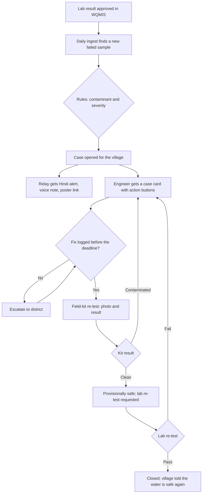

# JalSaathi: Product Requirements

| | |
|---|---|
| **Track** | Heat and Water (fits the organizers' line "If it makes the air cleaner, the water safer or the city lighter, it fits") |
| **Deadline** | Sun 11 Oct 2026, 20:00 IST (event countdown). We submit by 16:00. |
| **Owners** | Product: Umar · Build lead: Aman · Data: Reshma · Channels and UI: @faizsaleem8 (proposed; confirm in the group) |
| **Status** | Approved by the team on Fri 9 Oct 2026 |
| **Related** | [Build plan](docs/BUILD_PLAN.md) · [Decisions](docs/DECISIONS.md) · [Setup](docs/SETUP.md) · [Research](docs/RESEARCH.md) |

## 1. Summary

The government already tests rural drinking water and publishes the failures. Nobody tells the village, the advice people do get is often wrong for the contaminant, and nobody can see whether the source was fixed. JalSaathi turns each failed lab test into a case. The village hears about it in Hindi the same day, gets advice that is right for that contaminant, the block engineer is asked to fix it, and the case stays open until a re-test passes.

## 2. Problem

### What happens today

1. A lab under Jal Jeevan Mission (JJM) tests a village's water and finds it unsafe. The result is uploaded to the public portal JJM-WQMIS.
2. The result sits in an English table. Nothing pushes it to the people drinking the water.
3. JJM's own training material says a failed test requires remedial action and an alternative drinking supply. Nothing tracks whether that happens, in a way the village can see.
4. Villagers judge water by how it looks and smells. Water carrying E. coli often looks clear. Nitrate, fluoride and arsenic are invisible.
5. Where advice exists, it is usually "boil your water". That is right for bacteria and wrong for chemicals: boiling does not remove fluoride or arsenic, and it concentrates nitrate.

### Evidence (details and sources in [docs/RESEARCH.md](docs/RESEARCH.md))

- **2,616 villages** had E. coli in piped-water sources in lab tests from April to 9 October 2026; **5,334** had coliform bacteria; **3,090** had nitrate above the limit (JJM-WQMIS, read 9 Oct 2026). Last financial year: 4,640 villages with E. coli.
- In **Harpalpur block, Hardoi (UP)**, one lab batch approved on **15 June 2026** found E. coli (22 to 100 CFU per 100 mL, limit 0) in at least 8 villages, each on its own deep-tubewell scheme. Hardoi district has 18 villages with E. coli this year.
- The **2025 CAG audit** of JJM found 897 failed samples in Jammu and Kashmir never referred onward, and no functional block-level lab in Rajasthan as of July 2024.
- **Indore, Dec 2025 to Feb 2026:** sewage in the drinking-water pipeline killed between 16 and 32 people and made about 1,400 ill, after residents had complained about foul water for months.
- WHO estimates about **4.98 lakh deaths in India in 2019** from unsafe water, sanitation and hygiene, about 4.46 lakh of them from diarrhoea; safely managed drinking water for all households could avert nearly 4 lakh diarrhoeal deaths.

## 3. Users

| User | Who | Their decision | How they reach JalSaathi |
|---|---|---|---|
| **Primary: village relay** | Anganwadi worker or village water committee member. Illustrative persona: Sunita, anganwadi worker in Behta Lakhi, Harpalpur. She feeds about 30 children under six every day from the village tap, and is one of the women JJM trains to use field test kits. | Is this water safe to drink and cook with today? If not, what do we do until it's fixed? | Telegram bot (joins by link or by scanning the poster's QR code); forwards the Hindi voice note to the village WhatsApp group; pins the poster on the wall |
| **Secondary: fixer** | Block-level Junior or Assistant Engineer of the state water agency (U.P. Jal Nigam in the demo) | Which failed sources in my block need action first, and have I closed them? | Telegram case cards with action buttons; block map page |
| **Escalation** | District office (Executive Engineer or District Water and Sanitation Mission) | Which blocks are missing deadlines? | Escalation message (Telegram; email is stretch) |
| **Beneficiaries** | Households, especially children under five and pregnant women, drinking from the failed source | Use boiled or alternative water until the case closes | Voice note forwarded by the relay; wall poster; public village page |

## 4. Goals and non-goals

### Goals

- **G1. Warn the village the same day** a failed lab result is available, in Hindi, with a voice note for people who don't read.
- **G2. Give advice that is right for the contaminant**, traceable to an official source, never generated by a model.
- **G3. Track the fix** with a named next step and a deadline, and escalate when it is missed.
- **G4. Close only on evidence:** a field-kit result can make a case "provisionally safe"; only a passing lab result can close it.
- **G5. Work at scale from day one** with no enrolment, because the trigger is official data, not crowd reports.

### Non-goals (this weekend)

- Replacing public-health action or official notices. JalSaathi relays official results; it does not certify water.
- Real SMS, WhatsApp or phone (IVR) delivery. These need DLT registration or a Meta Business account; Telegram stands in.
- Writing back to WQMIS or any government system.
- Login screens. Telegram identity and an admin token are enough.
- Languages other than Hindi and English.

## 5. User stories

| ID | As a | I want | So that |
|---|---|---|---|
| US-1 | village relay | to get a Hindi alert with a voice note the day a lab test fails | I can warn families before more children fall ill |
| US-2 | village relay | advice for this exact contaminant | I don't tell people to boil water that boiling makes worse |
| US-3 | village relay | a poster with a QR code | families without smartphones see the warning on the wall |
| US-4 | village relay | to record my field-kit result with a photo | the village knows when the water is provisionally safe again |
| US-5 | block engineer | one card per failed source with buttons for what I did | I can log a fix in seconds and see what's still open |
| US-6 | block engineer | a map and list of open cases by severity and days open | I fix the worst first |
| US-7 | district office | an escalation when a deadline is missed | slow cases don't stay hidden |
| US-8 | anyone | a public village page | I can check a village's status and history without an app |

## 6. Scope

### Must ship (MVP)

1. WQMIS ingest for Uttar Pradesh and Rajasthan (E. coli, total coliform, nitrate, fluoride, arsenic), with retries, a partial-data guard, and a committed snapshot.
2. Rules engine: contaminant class, severity and advice from the sample's own limits and an advice library with sources.
3. Case workflow in Step Functions with deadlines, escalation, task-token callbacks and a demo clock.
4. Cedar policies that decide who and what can close a case, and block boil advice for chemicals.
5. Telegram bot: join by link or QR with consent, Hindi alert with a Polly voice note, engineer case cards with buttons, field-kit photo and result, `/status`, `/stop`.
6. Village page (Hindi first, English toggle) with a printable poster and QR code.
7. Block view with an Amazon Location map and a sorted case list.
8. Scale run: one Step Functions Distributed Map run opens a case for every failed village in both states, with time and cost measured.
9. Demo controls, preflight script, CloudWatch logs and an ingest-failure alarm.

### Stretch (only after the Saturday 18:00 freeze is green)

- **S1. Hindi video alert** per village (Polly narration over an animated card, about 20 seconds) to forward on WhatsApp. (Umar's input from the reels discussion.)
- **S2.** Bedrock reads the field-kit photo and suggests a result; the person still taps the answer.
- **S3.** Scheme-level warning: one failed source alerts every habitation on the same scheme.
- **S4.** District escalation email through SES.
- **S5.** Repeat-failure analysis: villages that failed in both financial years.

### Out of scope

See non-goals above.

## 7. Functional requirements

| ID | Requirement | Acceptance criteria |
|---|---|---|
| FR-1 | Ingest failed samples from WQMIS daily for the configured states and parameters | Re-running the ingest on the same data creates no duplicate samples or cases (idempotent on `SampleId`); each run stores its raw JSON in S3 with a timestamp |
| FR-2 | Protect against partial portal responses | If a state's count drops to zero or falls sharply against the last good snapshot, the run is marked partial and no case is closed or skipped because of it |
| FR-3 | Classify each failed sample | Contaminant class (microbial, chemical, physical), severity (red, amber, yellow) from the sample's acceptable and permissible limits; unit tests for every contaminant and threshold |
| FR-4 | Open one case per village and contaminant | A second failed sample for an open case adds to its timeline instead of opening a new case |
| FR-5 | Send the village alert | Subscribed relays receive, within 2 minutes of the case opening: village, contaminant, measured value against the limit, lab date, numbered advice in Hindi, a voice note, the page link and the "data as of" date |
| FR-6 | Contaminant-specific advice | Advice lines come only from the advice library; no message for a chemical contaminant contains boil advice (unit test plus Cedar deny) |
| FR-7 | Engineer case card | The block's engineer receives a card with actions (chlorination done, repair done, source changed, need help); a tap records the action and resumes the workflow |
| FR-8 | Escalation | When the fix deadline passes, the workflow escalates to the district role and records it on the timeline |
| FR-9 | Field-kit re-test | The bot asks for a photo and a result (black or yellow H2S vial); the photo is stored; "clean" moves the case to ProvisionallySafe, "contaminated" back to AwaitingFix |
| FR-10 | Lab closure | Only a passing lab result closes a case; any other close attempt is denied by Cedar and the denial appears on the timeline |
| FR-11 | Village page | Public URL per village: status, advice, voice note, test details, timeline, poster with QR, "data as of"; Hindi default with an English toggle; loads well on a low-end phone |
| FR-12 | Block view | Map of open cases with a list sorted by severity and days open |
| FR-13 | Consent and privacy | Nothing is stored until the person taps yes; `/stop` deletes their subscription; public pages never show phone numbers, names or chat IDs |
| FR-14 | Scale run | One Distributed Map run opens cases for all failed villages in UP and Rajasthan from the snapshot and reports duration, count and cost |
| FR-15 | Demo controls | Seed, reset, demo clock and a clearly labelled simulated lab result, all behind an admin token |
| FR-16 | Observability | Structured logs; an alarm when the ingest fails; `preflight.py` reports whether the live system is ready to record |

## 8. Non-functional requirements

| Area | Requirement |
|---|---|
| Safety | No model output decides anything about safety. Every advice line is traceable to a source. A native Hindi speaker reviews all Hindi copy. |
| Honesty | Simulated parts are labelled on screen. We say "no fix visible to the village", never "nothing was done". "Not tested" is shown as unknown, never as safe. |
| Reliability | The demo runs from the committed snapshot if WQMIS is down. Workflows retry transient errors. |
| Performance | Village alert within 2 minutes of a case opening; village page under 2 seconds on 4G. |
| Cost | The whole build and demo under $10 of AWS credit; the scale run's cost is measured and shown. |
| Privacy | Store only chat ID, role, village and consent time. Delete on `/stop`. |
| Accessibility | Hindi first, large type, voice note, poster for households without phones, works on low-end Android. |
| Security | Secrets in SSM Parameter Store; Telegram webhook checks its secret header; admin routes need a token; each Lambda gets only the permissions it needs. |

## 9. Key flows

## 10. Success metrics

These are the numbers the video and writeup will show. Each is measured, not estimated.

| Metric | Target for the demo |
|---|---|
| Time from case opening to the village alert arriving on a phone | Under 2 minutes (status quo for Harpalpur: 116 days and counting with no fix visible) |
| Villages covered in one scale run (UP and Rajasthan, this year) | Every failed village in the snapshot |
| Scale-run duration and cost | Measured and shown |
| Advice correctness | Every contaminant and threshold covered by tests; "nitrate never says boil" is a test and a Cedar rule |
| Loop completion | A demo case goes from Detected to Closed on camera, including a Cedar denial |
| Cost per village alert | Measured |
| Repeat failures (stretch) | Share of last year's E. coli villages that failed again this year |

## 11. Demo scenario (real records)

- **Primary:** Behta Lakhi, Harpalpur, Hardoi, UP. Deep tubewell, scheme 20059029. E. coli 80 CFU/100 mL, limit 0. Lab approval 15 Jun 2026.
- **Chemical contrast:** Dhabla Kalayanpura, Anta, Baran, Rajasthan. Deep tubewell, scheme 20004324. Nitrate 60 mg/L, limit 45. Lab approval 5 Aug 2026.
- **Single-sample walkthrough:** Mahmood Pur Keerat, Chhibramau, Kannauj, UP. Sample U3027060S38720650, E. coli 50 CFU/100 mL, State Level Water Analysis Laboratory, U.P. Jal Nigam (Rural), Lucknow, approved 21 Aug 2026.

The full verified list is in [data/fixtures/wqmis_demo_records.json](data/fixtures/wqmis_demo_records.json).

## 12. Risks

| Risk | Mitigation |
|---|---|
| WQMIS times out or returns partial data (seen on 9 Oct evening) | Committed snapshot, retries, partial-data guard, "data as of" banner |
| Wrong safety advice | Advice library with sources, tests, Cedar rule, native-speaker review |
| We start about 36 hours after the strongest teams | Deploy-first, four parallel lanes, freeze Saturday 18:00, cut stretch without debate |
| Judges see "another tap-water bot" | Open the video on clear water that has E. coli in it; the nitrate contrast; the scale run |
| Lab results are months old | Show the lab date and the days since; the gap is the story |
| Bedrock unavailable | Nothing depends on it; it's only used in stretch S2 |

## 13. Open questions

| Question | Owner | Needed by |
|---|---|---|
| Lane owners confirmed? | Everyone | Fri 23:30 check-in |
| Telegram bot name and token | Whoever creates it | Fri 22:00 |
| Email address for the AWS budget alert and SES test inbox | Aman | Sat 09:00 |
| Does WQMIS Format WQ2 (Remedial Action) list fix dates for the Harpalpur samples? | Umar | Sat 09:00 |
| License for the repo (MIT proposed) | Aman | Sun 12:00 |

## 14. Release criteria (what "ready to submit" means)

- [ ] The full loop runs on the deployed system: ingest, alert with voice note on a real phone, engineer action, kit result, Cedar denial, lab pass, closed.
- [ ] Village page and block view work on a phone from the public URL.
- [ ] Scale run completed with time, count and cost recorded.
- [ ] All tests pass in CI.
- [ ] Video of 3 minutes or less on YouTube (public or unlisted) opens in a signed-out browser and shows AWS in use.
- [ ] Writeup covers the problem, the build, where AWS fits, data sources and freshness, and the AI tools used.
- [ ] README credits every data source, library and asset.
- [ ] Commit history sits inside 8 to 11 Oct 2026.
- [ ] Every member's AWS Builder Center student verification is done.
