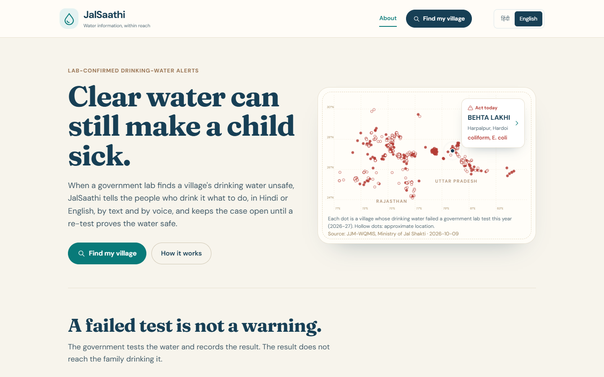
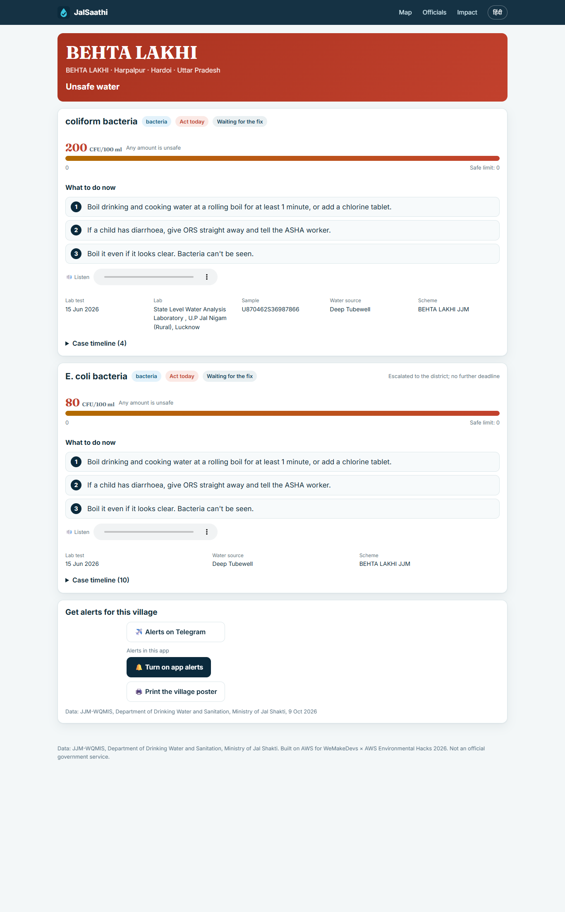
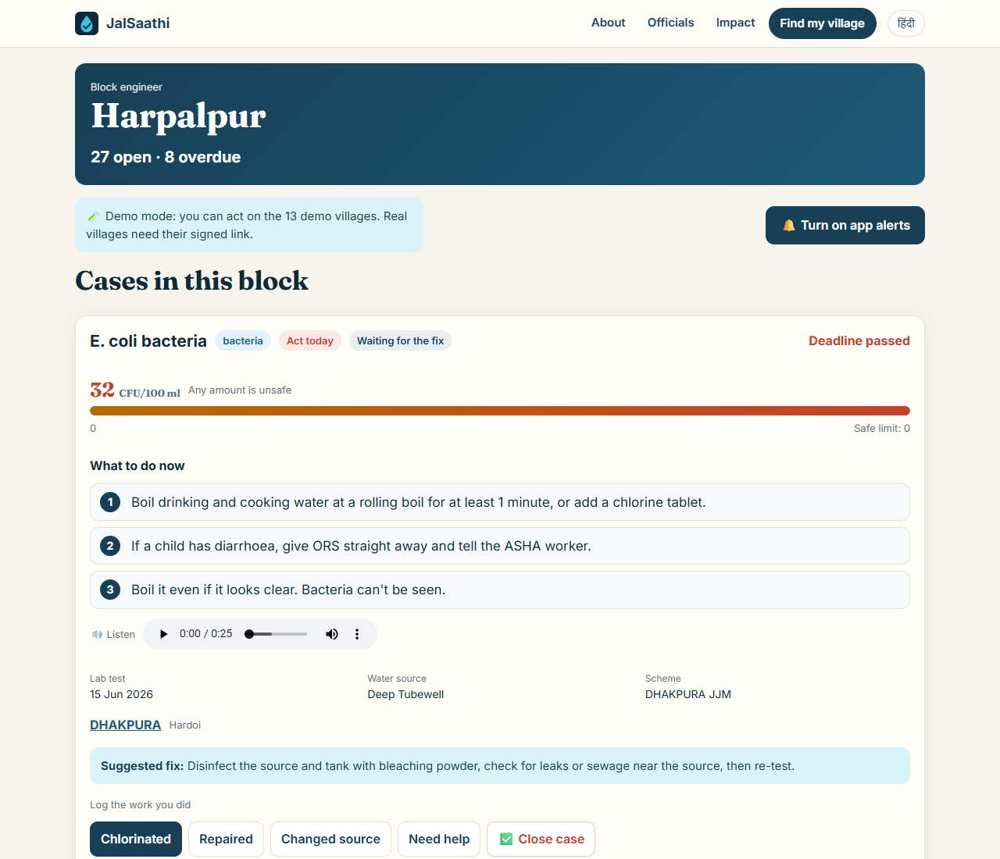
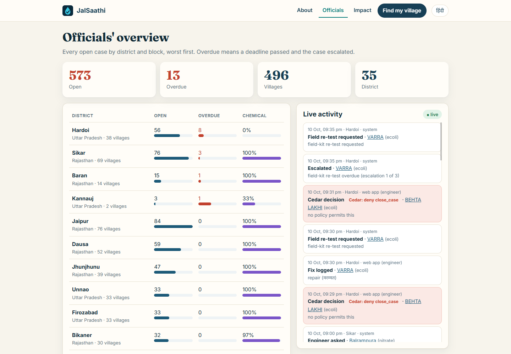
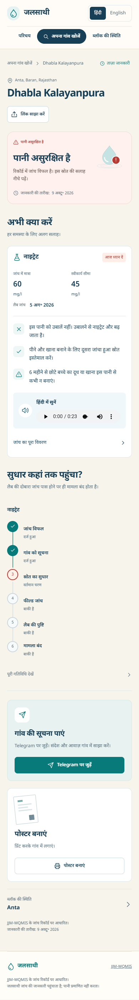
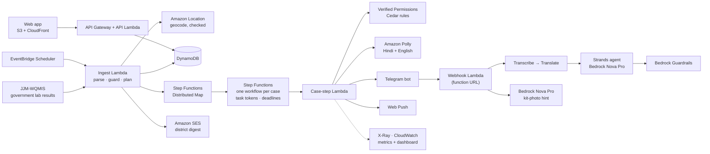

# JalSaathi (जलसाथी): clear water can still make a child sick

[](https://github.com/23f2001033/Environmental-Hacks/actions/workflows/ci.yml)

**When a government lab finds a village's drinking water unsafe, JalSaathi tells the people who drink it what to do (in Hindi or English, by text and by voice), makes the block engineer responsible for the fix, and keeps the case open until a re-test proves the water safe.**

Built for **Environmental Hacks** (WeMakeDevs × AWS, Bharat Builds Tour, event 02), **Heat and Water** track, 8–11 October 2026. Running on AWS in Mumbai (`ap-south-1`) on real government data.

**Try it:** [the site](https://d2735023v3xj6.cloudfront.net) · [a village page](https://d2735023v3xj6.cloudfront.net/?v=412558) · [the Telegram bot](https://t.me/Srott_bot?start=v_412558) (Hindi; send `/english`) · [engineer screen](https://d2735023v3xj6.cloudfront.net/app/engineer/5037?k=demo) · [health-worker screen](https://d2735023v3xj6.cloudfront.net/app/relay/412558?k=demo) · [officials' live feed](https://d2735023v3xj6.cloudfront.net/app/officials)



## Results at a glance

Numbers from the live system and the committed WQMIS snapshot (9 Oct 2026). The weak ones are here too.

| | Result | Source |
|---|---|---|
| **Real cases** | **573** failed lab tests in **496 villages**, 35 districts of Uttar Pradesh and Rajasthan (560 from the snapshot + 13 hand-checked demo records) | `/api/v1/stats` |
| **How long the result has sat unused** | Median **105 days** since the lab found it; **74%** older than 60 days. The portal records it; nothing in it tells the village or forces a fix | [`data/analysis/days_since_test.json`](data/analysis/days_since_test.json) |
| **Why "just boil it" is wrong** | **87%** (499 of 573) are nitrate, fluoride or arsenic: boiling doesn't help, and concentrates nitrate | `/api/v1/stats` → `open_by_code` |
| **Same failure next year** | **149 of 1,233** villages (12.1%) that failed in 2025-26 failed the same test again in 2026-27, with half the year still to come | [`data/analysis/repeat_failures.json`](data/analysis/repeat_failures.json) |
| **Scale** | One Step Functions Distributed Map started **560 of 560** case workflows in **611 s**, **0 failed**, paced to fit a new account's Lambda limit of 10 | `/api/v1/stats` → `scale_run` |
| **Estimated cost** | About **$0.43** for those 560 cases (≈ $0.0008 per case), mostly geocoding; voice notes are made only when someone listens. An estimate from list prices | [`src/jalsaathi/costs.py`](src/jalsaathi/costs.py) |
| **Alert time** | Failed test → village warned: median **5 s** (demo run). Ask JalSaathi answers in **2–10 s**; Hindi speech to text in about **3 s** | `/api/v1/stats` → `alert_latency`; measured |
| **Answers checked** | Every model answer must be grounded in the village's own results (Bedrock Guardrails, threshold 0.7) and pass Cedar, or the person gets the official advice instead | [D-32](docs/DECISIONS.md) |
| **Weak: map pins** | Only **172 of 496** pins are at the village; 202 at the block centre, 119 at the district centre (drawn hollow), 3 unplaced. The geocoder put villages in the wrong district, so we only trust name + district matches | [D-29](docs/DECISIONS.md) |
| **Weak: not yet in the field** | No real villager or engineer has used it yet. The **lab re-test is simulated** in the demo (labelled on screen); the field kit only makes a case *provisionally* safe | — |
| **Weak: reach** | Telegram and a web app need a smartphone. Posters with a QR code and forwarding the voice note are the bridge for now; SMS and phone calls are next | — |
| **Tests** | 226 backend tests + 9 frontend tests, run in CI on every pull request | [`tests/`](tests), [`frontend/tests/`](frontend/tests) |

## The problem

Jal Jeevan Mission labs test village drinking water and publish every failure on a public portal, [JJM-WQMIS](https://ejalshakti.gov.in/WQMIS/Main/report). This year (April to 9 Oct 2026) they found E. coli in the piped-water sources of 2,616 villages, nitrate in 3,090 and fluoride in 1,359. The failure is recorded, but nothing carries it to the family drinking the water, and nothing forces a fix: water with E. coli looks clear, and nitrate, fluoride and arsenic are invisible. The CAG found 897 failed samples in Jammu and Kashmir that were never referred onward ([Report No. 10 of 2025](https://cag.gov.in/en/audit-report/details/123724)). When a warning does exist, it is usually "boil your water", which is right for bacteria and wrong for nitrate. Full sources: [docs/RESEARCH.md](docs/RESEARCH.md).

## How it works

1. **The lab result arrives.** We read JJM-WQMIS the way its own pages do (UP and Rajasthan), with a guard that refuses partial portal responses.
2. **The village is warned.** One AWS Step Functions workflow per case sends a Hindi or English alert with an Amazon Polly voice note to the village's health worker on Telegram and in the app (Web Push), with the advice for *that* contaminant. A Cedar policy forbids "boil" for chemical contamination.
3. **People ask questions by voice.** "क्या मैं इस पानी को उबालकर पी सकता हूं?" Amazon Transcribe → Amazon Translate → a **Strands agent on Amazon Bedrock** that may only read this village's results → **Bedrock Guardrails** checks the answer is grounded → Cedar → Translate → Polly speaks the answer.
4. **The engineer is accountable.** The block engineer gets the case with a deadline (Telegram or the engineer screen). A missed deadline escalates, and an **EventBridge Scheduler** job emails each district official (**Amazon SES**) the overdue cases.
5. **Only a re-test closes it.** "Close case" from the engineer is refused by a Cedar policy in **Amazon Verified Permissions**. A field-kit photo (read by **Bedrock Nova Pro** as a suggestion; the person decides) makes it provisionally safe; only a passing lab re-test closes it.

| Village page (Hindi or English, voice note, poster) | Engineer screen: log the fix; closing is refused |
|---|---|
|  |  |
| **Officials: every district and block, live activity feed** | **Village page on a phone, in Hindi** |
|  |  |

## Architecture



| AWS service | What it does here |
|---|---|
| **AWS Step Functions** | One Standard workflow per case (task tokens wait for the engineer, the field kit and the lab; deadlines escalate, at most three times); an Express **Distributed Map** starts hundreds of cases at a steady pace |
| **AWS Lambda** | Ingest, case steps, Telegram webhook (function URL), web API; Python 3.12 on arm64 |
| **Amazon DynamoDB** | One table: villages, samples, cases, timelines, subscriptions, the activity feed |
| **Amazon S3 + CloudFront** | Both web apps, voice notes and kit photos (private); a CloudFront Function routes the single-page apps |
| **Amazon API Gateway** | The public `/api/v1` (HTTP API) |
| **Amazon Polly** | Kajal neural voice: every alert and answer as a Hindi or English voice note |
| **Amazon Transcribe** | Streaming Hindi speech-to-text for voice questions (Telegram's OGG/Opus as is) |
| **Amazon Translate** | Hindi ↔ English around the agent |
| **Amazon Bedrock** | Nova Pro: the Ask JalSaathi agent and the field-kit photo hint |
| **Bedrock Guardrails** | Contextual grounding of every answer against the facts the agent read; content filters; PII masking |
| **Amazon Verified Permissions** | The four Cedar rules (close only on a lab pass; kit only provisional; never "boil" for chemicals) decide every action |
| **Amazon Location Service** | Geocoding (accepted only on a name + district match) and the map tiles (API key restricted to our site) |
| **Amazon SES + EventBridge Scheduler** | The district digest: one email per district official with the overdue cases, only when something changed |
| **AWS Systems Manager Parameter Store** | Bot token, webhook secret, admin token, Web Push key: encrypted, never in code |
| **Amazon CloudWatch + AWS X-Ray** | Business metrics (cases, alerts, fixes, questions, Cedar refusals, grounding score) on a dashboard; traces across every AWS call |
| **AWS CDK** (Python) | The whole stack, one `cdk deploy` |

**AWS open source:** [AWS CDK](https://github.com/aws/aws-cdk) (infrastructure), [Cedar](https://github.com/cedar-policy) (the case rules, evaluated locally as a fallback via `cedarpy`), [Strands Agents](https://github.com/strands-agents/sdk-python) (the Ask JalSaathi agent), [Amazon Transcribe streaming SDK](https://github.com/awslabs/amazon-transcribe-streaming-sdk), boto3.

## Safety and honesty by design

- **Rules in policy, not in prompts.** Closing a case, marking it provisional, and what a message may say are Cedar policies in Verified Permissions. Any evaluation error is a deny.
- **The model never decides the advice.** The advice library (`content/advice.json`, with sources) is written by people; the agent may only rephrase facts from the village's own record, and Guardrails checks it did.
- **Simulated parts are labelled on screen:** the lab re-test button and the demo clock (minutes instead of days). 13 hand-checked demo villages are open to everyone; real villages need a signed link for relay and engineer actions.
- **Privacy:** people join only after a consent message; `/stop` deletes their subscriptions and settings; we never see or store phone numbers (only a Telegram chat ID); kit photos are kept private with the case, never published.
- **Every decision is recorded** on the case timeline and in the officials' feed.

Design decisions and the reasoning behind each: [docs/DECISIONS.md](docs/DECISIONS.md) (34 decisions, including what we tried and dropped).

## Run it

```bash
python -m venv .venv && .venv/Scripts/pip install -r requirements-dev.txt   # Python 3.12
.venv/Scripts/python -m pytest -q                                           # 226 tests, no AWS needed
cd frontend && npm ci && npm test && npm run build                          # village site (Vite)
cd ../app && npm ci && npm run build                                        # role screens (React + Vite)
cd .. && python scripts/build.py && npx aws-cdk@2 deploy                    # Lambda bundle + layer, then the stack
python scripts/set_webhook.py                                               # point the Telegram bot at the webhook
python scripts/demo.py restart-demo                                         # fresh demo cases
```

Setup details and secrets: [docs/SETUP.md](docs/SETUP.md). API contract: [docs/API.md](docs/API.md). Status log: [state.md](state.md). Video script: [video/SCRIPT.md](video/SCRIPT.md).

| Folder | What's in it |
|---|---|
| `src/jalsaathi/` | The backend: ingest, case steps, Telegram webhook, API, assistant, policy, digest |
| `infra/` | The CDK stack and the CloudWatch dashboard |
| `frontend/` | The village site at `/` (About, Find my village, village and block pages) |
| `app/` | The role screens at `/app/` (engineer, health worker, officials, impact) |
| `content/`, `policies/` | The advice library and the Cedar rules |
| `data/` | WQMIS snapshot, demo records, analyses |
| `scripts/` | Build, deploy, demo, analysis, setup |

## Team

| | Contributions |
|---|---|
| **Aman** ([@23f2001033](https://github.com/23f2001033)) | Team lead; idea and research; AWS architecture and deployment; backend, workflow, assistant and policies (with Claude Code); reviews and merges |
| **Reshma** ([@reshmag2023-boop](https://github.com/reshmag2023-boop)) | WQMIS portal client and the guarded ingestion validation; demo coordinates; the evidence behind every slide number |
| **Faiz** ([@faizsaleem8](https://github.com/faizsaleem8)) | The village-first web design (`frontend/`): village report, directory, block queue, poster |
| **Umar** ([@U-m-4r](https://github.com/U-m-4r)) | Phone testing and QA, Hindi review, the About-page design brief, the demo video |

## Data, credits and AI tools

- **Data:** Jal Jeevan Mission Water Quality Management Information System (JJM-WQMIS), Department of Drinking Water and Sanitation, Ministry of Jal Shakti, Government of India. Limits per IS 10500:2012 as returned with each sample. JalSaathi relays government test information; it does not certify water and is not a government service.
- **Libraries and fonts:** MapLibre GL JS (BSD-3-Clause), React, Vite, node-qrcode (MIT), cedarpy, Strands Agents, Amazon Transcribe streaming SDK (Apache-2.0); Fraunces, Tiro Devanagari Hindi, Noto Sans Devanagari, DM Sans, Inter (SIL OFL); map tiles © AWS, HERE; About-page state outlines and rivers from Natural Earth 1:10m v5.1.2 (public domain), built by `scripts/build_map_shapes.py`.
- **AI tools used:** **Claude Code** (Anthropic) for research, planning, documentation and most of the code, driven and reviewed by the team. At runtime the product uses Amazon Bedrock (Nova Pro), always behind Guardrails and Cedar.
