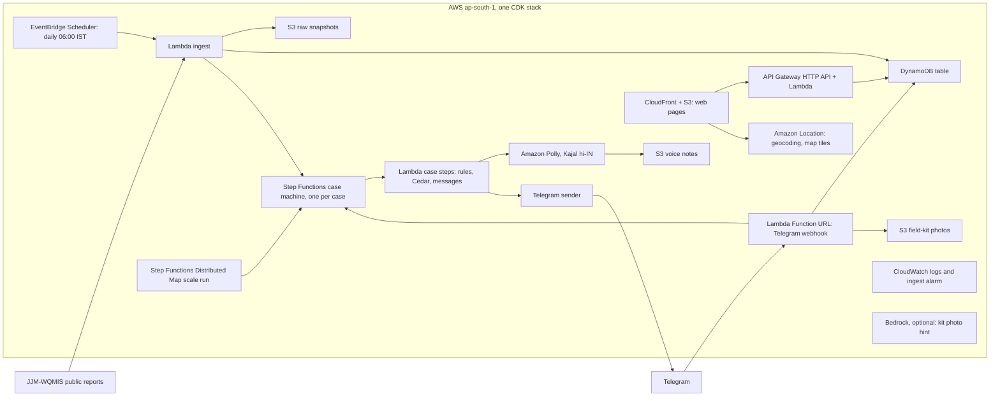
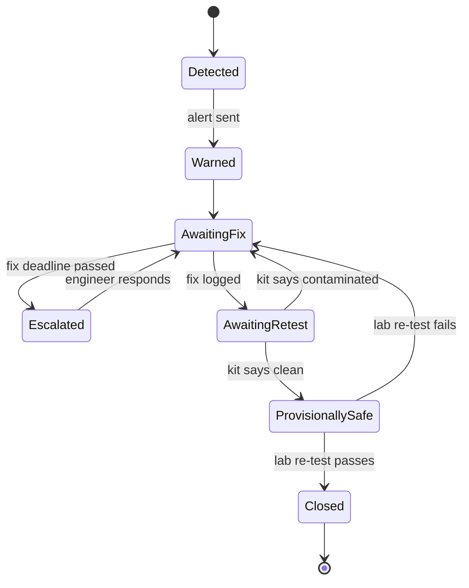

# Build plan

How we build JalSaathi between Fri 9 Oct 21:00 IST and the Sun 11 Oct 20:00 IST deadline. Read [PRD.md](../PRD.md) for what and why, [DECISIONS.md](DECISIONS.md) for the reasoning behind each choice, and [SETUP.md](SETUP.md) for what must be ready first.

## Contents

1. [Architecture](#1-architecture)
2. [Repository layout](#2-repository-layout)
3. [Data pipeline](#3-data-pipeline)
4. [Domain model and storage](#4-domain-model-and-storage)
5. [Case workflow](#5-case-workflow)
6. [Cedar policies](#6-cedar-policies)
7. [Rules and advice library](#7-rules-and-advice-library)
8. [Telegram bot](#8-telegram-bot)
9. [Web pages](#9-web-pages)
10. [API](#10-api)
11. [Configuration and secrets](#11-configuration-and-secrets)
12. [Lanes and tasks](#12-lanes-and-tasks)
13. [Timeline](#13-timeline)
14. [Team workflow](#14-team-workflow)
15. [Testing](#15-testing)
16. [Demo video production](#16-demo-video-production)
17. [Submission checklist](#17-submission-checklist)
18. [Credits](#credits)

## 1. Architecture

Everything runs in AWS ap-south-1 (Mumbai) in one CDK stack.



| Component | AWS | Responsibility |
|---|---|---|
| Ingest | EventBridge Scheduler, Lambda, S3, DynamoDB | Pull failed samples, store raw JSON, upsert villages and samples, start case executions |
| Case workflow | Step Functions (Standard), Lambda | Deadlines, escalation, callbacks, closure |
| Scale run | Step Functions Distributed Map | Start a case execution for every failed village in the snapshot; measure time and cost |
| Policy | Cedar via `cedarpy` inside Lambda | Decide close, provisional and message actions; fail closed |
| Voice | Polly | Hindi MP3 per alert |
| Bot | Lambda Function URL | Telegram webhook: joins, consent, buttons, photos, commands |
| Web | S3, CloudFront | Village page, block view, poster |
| API | API Gateway HTTP API, Lambda | Read model for pages; admin demo controls |
| Maps | Amazon Location | Geocode villages; map tiles through an API key |
| Ops | CloudWatch | Logs, ingest-failure alarm |

## 2. Repository layout

```
infra/                  CDK app (Python): app.py, stack.py
src/jalsaathi/
  wqmis.py              portal client: AES params, sessions, pagination, retries, partial-data guard
  parse.py              sample source text -> source type, scheme ID and name, value and unit
  ingest.py             Lambda: snapshot -> samples -> cases (idempotent)
  rules.py              contaminant class, severity, deadlines
  advice.py             loads the advice library, builds messages
  policy.py             Cedar evaluation and audit events
  case_steps.py         Step Functions task handlers
  telegram.py           Bot API client, webhook handler, channel adapter
  voice.py              Polly synthesis to S3
  api.py                web API Lambda
  store.py              DynamoDB access
policies/case.cedar     Cedar policies
content/advice.yaml     advice library (Hindi and English, sources), reviewed by lane 4
web/                    index.html (village), block.html, poster.html, app.js, styles.css
data/fixtures/          verified demo records (committed)
data/snapshot/          WQMIS snapshots (committed, with manifest)
scripts/                demo.py, preflight.py, snapshot_wqmis.py, set_webhook.py, tour.py
tests/                  pytest
video/                  script.md, slides-data.json, recording-checklist.md
docs/                   this plan, decisions, setup, research
```

## 3. Data pipeline

### Endpoints (all `https://ejalshakti.gov.in/WQMIS/Report/...`)

| Call | Method | Parameters (each AES-encrypted) | Returns |
|---|---|---|---|
| `Contaminantwisesamplelist?…` | GET | `paraname, fy, stid, dtid, blid, gpid, villid` | HTML page; opening it starts the session cookie |
| `ContaminantwiseVillagefil/` | POST | `cpage, paraname, stid, dtid, blid, gpid, villid, fy` | `Contaminantwise[]`: state, district, block, panchayat and village names and IDs, failed-sample count |
| `Contaminantwisesamplefillist/` | POST | `cpage, paraname, stid, dtid, villid, fy` | `Contaminantwise[]`: `SampleId`, `sample_sourceName`, `Parametervalue`, `Acceptablelimit`, `Permissiblelimit`, `labname`, `s_report_approval_action_time` |
| `GetContaminantwiseData?…` | GET | `cpage, st, dt, bl, gp, vill, fy, IsPws, SchemeId, SampleType` | Counts by parameter per state (state level works; district level returned HTTP 500 on 9 Oct) |

- **Encryption:** AES-128-CBC, PKCS7, key and IV both `8080808080808080` (from the portal's own `frmValidate.js`), base64 output.
- **Parameter names:** `Ecoil`, `Coliform`, `Nitrate`, `Fluoride`, `Total arsenic`, `Iron`, `TDS`.
- **IDs:** Uttar Pradesh 31, Rajasthan 27. Hardoi 481, Harpalpur block 5037, Kannauj 486.
- **Financial year:** `2026-2027` format.
- **Pagination:** call `cpage` 1, 2, 3… until an empty page. Don't assume a page size.

### Parsing `sample_sourceName`

Example: `Location : MAHMOOD PUR KEERAT CHHIBRAMAU [ Source type : Deep Tubewell ] [ schemeId : 20014829, scheme name : MAHMOOD PUR KEERAT GRAMIN PEYJAL YOJNA, Type : PWS ]`

Extract source type, scheme ID, scheme name and PWS flag with regexes; keep the raw string. `Parametervalue` looks like `50.000 (CFU/100 ml)` or `60.000 (mg/l)`: split value and unit.

### Partial-data guard

- Keep the last good counts per state and parameter.
- If a count drops to zero or by more than half, mark the run `partial`, keep existing cases untouched and raise the CloudWatch alarm.
- A sudden zero is never read as "fixed".

### Snapshot

`scripts/snapshot_wqmis.py` writes `data/snapshot/wqmis_<fy>_<state>_<param>.json` plus `manifest.json` (fetched time, file list, counts). The ingest Lambda can read from the live portal or from the snapshot in S3 (`SOURCE=live|snapshot`). The demo always runs from the snapshot for reproducibility.

## 4. Domain model and storage

### Entities

| Entity | Key fields |
|---|---|
| Village | id, names (state, district, block, panchayat, village) and IDs, coordinates, scheme IDs |
| Sample | sample ID, village, parameter, value, unit, acceptable and permissible limits, lab, approval time, source type, scheme |
| Case | case ID, village, contaminant, severity, status, opened at, fix deadline, retest deadline, task token reference |
| Event | case, time, type, actor role, details, Cedar decision |
| Subscriber | Telegram chat ID, role (relay, engineer, district), village or block, consent time |

### DynamoDB single table `jalsaathi`

| PK | SK | Item |
|---|---|---|
| `VILLAGE#<villageId>` | `META` | Village |
| `VILLAGE#<villageId>` | `SAMPLE#<approvalDate>#<sampleId>` | Sample |
| `VILLAGE#<villageId>` | `SUB#tg<chatId>` | Relay subscriber |
| `BLOCK#<blockId>` | `SUB#tg<chatId>` | Engineer subscriber |
| `CASE#<caseId>` | `META` | Case |
| `CASE#<caseId>` | `EVT#<ts>#<n>` | Timeline event, including every Cedar decision |
| `CASE#<caseId>` | `KIT#<ts>` | Field-kit result and photo key |
| `TOK#<shortId>` | `META` | Step Functions task token behind a Telegram button (TTL 14 days) |
| `UPD#<updateId>` | `META` | Telegram update de-duplication (TTL 2 days) |
| `RUN#<runId>` | `META` | Ingest or scale-run summary: counts, partial flag, duration, cost estimate |

GSI1 (`GSI1PK`, `GSI1SK`): `BLOCK#<blockId>` / `STATUS#<status>#<openedAt>` for open cases per block.

Case ID: `<villageId>-<param>-<firstSampleId or date>`, so re-ingesting never duplicates a case.

## 5. Case workflow



### Step Functions definition (Standard), in order

1. **InitCase** (Lambda): write the case, timeline event `detected`.
2. **BuildAdvice** (Lambda): rules, advice library, Cedar `send_message` check, Polly MP3 to S3.
3. **NotifyVillage** (Lambda): Telegram text plus audio to relay subscribers; event `warned`.
4. **AwaitFix** (Lambda `.waitForTaskToken`, `TimeoutSeconds` = fix deadline): sends the engineer card, stores the token under `TOK#`. On timeout go to **Escalate** (Lambda: district message, event) and back to AwaitFix (at most 3 loops).
5. **AwaitKit** (`.waitForTaskToken`, retest deadline): asks the relay for the field-kit photo and result. Choice: `contaminated` → AwaitFix; `clean` → **MarkProvisional** (Cedar check, notify).
6. **AwaitLab** (`.waitForTaskToken`): resolved by a lab result. In the demo this is the admin button "simulated lab result", labelled on screen; later, a WQMIS re-test read by the ingest. Choice: `pass` → **CloseCase** (Cedar check, notify "safe again"); `fail` → AwaitFix.

**Demo clock:** `DEMO_CLOCK=1` turns 48 hours into 4 minutes, 7 days into 6 minutes and 14 days into 8 minutes, and every message says "demo clock".

### Scale run

A Distributed Map reads the snapshot's village list from S3 (`ItemReader`), with `MaxConcurrency` 40. For each item it calls `states:startExecution` on the case machine with `quiet=true` (no Telegram messages except for subscribed demo villages). It writes results to S3 (`ResultWriter`). `RUN#` records count, duration and estimated cost.

## 6. Cedar policies

`policies/case.cedar` (outline; final syntax in code):

```cedar
// Only a passing lab result can close a case.
permit (principal, action == Action::"close_case", resource)
when { context.evidence == "lab_pass" };

// A field-kit "clean" can only make a case provisional.
permit (principal, action == Action::"mark_provisional", resource)
when { context.evidence == "kit_clean" };

// Messages are allowed...
permit (principal, action == Action::"send_message", resource);

// ...except boil advice for chemical contaminants.
forbid (principal, action == Action::"send_message", resource)
when { context.contaminant_class == "chemical" && context.mentions_boil };
```

- Anything not explicitly permitted is denied.
- Missing context or an evaluation error is a deny.
- Every decision is written to the case timeline as `EVT#` with action, decision, policy ID and reason, so the demo can show "engineer tries to close, Cedar denies".

## 7. Rules and advice library

Limits come from each sample (`Acceptablelimit`, `Permissiblelimit`). The library supplies class, advice and fallbacks.

| Parameter | Class | Severity | Do now | Never | Engineer fix |
|---|---|---|---|---|---|
| E. coli, total coliform | microbial | red if detected | Rolling boil for at least 1 minute or chlorine tablets; ORS for diarrhoea; tell the ASHA | "It looks clear so it's fine" | Disinfect source and tank; look for leaks or sewage near the source |
| Nitrate | chemical | red above 45 mg/L | Another tested source for drinking and cooking; never for infants under 6 months | Boiling | Change, deepen or blend the source |
| Fluoride | chemical | amber above 1.5; yellow 1.0 to 1.5 mg/L | Another tested source, children and pregnant women first | Boiling | Defluoridation unit; alternate source |
| Arsenic | chemical | red above the sample's permissible limit | Another tested source | Boiling | Arsenic removal unit; alternate source |
| Turbidity | physical | amber above 5 NTU | Settle, filter through cloth, then boil | Drinking it unfiltered | Find ingress; flush |
| Residual chlorine | microbial risk | amber below 0.2 mg/L | Boil until a re-test shows chlorine | — | Fix dosing |
| Iron, TDS | aesthetic | yellow; TDS amber above 2,000 | Settle and filter; above 2,000 TDS another source | Panic messages | Iron filter; community RO |

`content/advice.yaml` holds, per parameter: `class`, `advice_hi[]`, `advice_en[]`, `never[]`, `engineer_fix[]`, `sources[]`. Lane 4 reviews every Hindi line. A parameter missing from the library gets severity `review`: no advice is sent automatically, and the engineer card says "needs review".

## 8. Telegram bot

| Item | Spec |
|---|---|
| Webhook | `POST /tg` on the Lambda Function URL. Reject requests whose `X-Telegram-Bot-Api-Secret-Token` header doesn't match SSM `/jalsaathi/telegram/webhook-secret`. |
| Deep links | `t.me/<bot>?start=v_<villageId>` (relay), `?start=e_<blockId>` (engineer), `?start=d_<districtId>` (district, stretch). The poster's QR encodes the relay link. |
| Consent | On `/start`: explain in Hindi what is stored, with buttons हाँ / नहीं. Store `SUB#` only on हाँ. नहीं deletes anything saved. |
| Commands | `/status` (village status), `/stop` (delete subscription), `/help` |
| Relay alert | Text (HTML parse mode): village, contaminant, value against limit, lab date, numbered advice, page link, "data as of". Then `sendAudio` with the Polly MP3. |
| Engineer card | Text plus inline buttons: क्लोरीनेशन किया (chlorination done), मरम्मत की (repair done), स्रोत बदला (source changed), मदद चाहिए (need help). `callback_data` = `fix:<shortId>:<action>`; `shortId` maps to the task token under `TOK#`. |
| Field-kit flow | Bot asks for a photo of the H2S vial after 24 to 48 hours, then buttons काला (black, contaminated) / पीला (yellow, clean). Photo saved to S3; result resumes AwaitKit. |
| De-duplication | Conditional put on `UPD#<update_id>`; repeats are ignored. |
| Adapter | `channel.send(subscriber, message)` so WhatsApp can replace Telegram later. |

## 9. Web pages

| Page | Contents |
|---|---|
| `index.html?v=<villageId>` (village) | Status banner (unsafe, provisional, safe, unknown); numbered advice; voice-note player; test details (sample, value against limit, lab, date); case timeline; "data as of"; Hindi default with an English toggle; "Print poster" button |
| `poster.html?v=<villageId>` | A4 poster in Hindi with the status, the three most important actions and a QR code to the village page and bot |
| `block.html?b=<blockId>` (block view) | Amazon Location map with open cases; list sorted by severity and days open; links to village pages |

Plain HTML, CSS and JavaScript; MapLibre GL from a pinned CDN version; Noto Sans Devanagari; phone-first; no build step.

## 10. API

API Gateway HTTP API in front of `api.py`.

| Route | Auth | Returns or does |
|---|---|---|
| `GET /api/villages/{id}` | public | `{village, status, case, samples, advice: {hi, en}, audio_url, timeline, data_as_of}` |
| `GET /api/blocks/{id}/cases` | public | `[{case_id, village, lat, lon, contaminant, severity, status, days_open}]` |
| `GET /api/cases/{id}` | public | Case with timeline (no personal data) |
| `POST /api/admin/ingest` | admin token | Runs the ingest (`source=snapshot|live`) |
| `POST /api/admin/scale-run` | admin token | Starts the Distributed Map |
| `POST /api/admin/lab-result` | admin token | Simulated lab result `pass|fail` for a case (labelled) |
| `POST /api/admin/reset` | admin token | Deletes demo cases and events |

## 11. Configuration and secrets

| Name | Where | Purpose |
|---|---|---|
| `/jalsaathi/telegram/bot-token` | SSM SecureString | Bot API token |
| `/jalsaathi/telegram/webhook-secret` | SSM SecureString | Webhook header check |
| `/jalsaathi/console-token` | SSM SecureString | Admin routes and demo controls |
| `TABLE_NAME`, `BUCKET`, `STATE_MACHINE_ARN`, `DEMO_CLOCK`, `SOURCE`, `PUBLIC_BASE_URL` | Lambda environment (CDK) | Wiring |
| Amazon Location API key | CDK resource, restricted to the CloudFront domain | Map tiles and geocoding from the browser |

Never commit secrets. `.env.local` is git-ignored for local runs.

## 12. Lanes and tasks

Owners are proposed; confirm in the Friday 23:30 check-in. Claude Code (in Aman's session) implements most code; the lane owner reviews, tests and accepts it against "done means".

### Lane 1: Data and proof (proposed owner: Reshma)

| ID | Task | Depends on | Done means |
|---|---|---|---|
| L1.1 | Move the WQMIS client into `src/jalsaathi/wqmis.py` with pagination, retries and the guard | — | Unit tests pass on recorded responses |
| L1.2 | Snapshot UP and Rajasthan, 5 parameters, both years; commit with manifest | Portal up | `data/snapshot/manifest.json` committed |
| L1.3 | Ingest Lambda: parse, upsert villages and samples, start cases idempotently | L1.1, L2.2 | Running it twice creates the demo cases once |
| L1.4 | Coordinates for demo villages (Amazon Location plus a manual check) | — | `data/fixtures/coordinates.json` |
| L1.5 | Proof numbers into `video/slides-data.json`: coverage, alert latency, scale run, repeat failures | L2.6 | Every number has a source |

### Lane 2: Workflow and infrastructure (owner: Aman, with Claude Code)

| ID | Task | Depends on | Done means |
|---|---|---|---|
| L2.1 | CDK stack: table, buckets, Function URL webhook echo; `cdk bootstrap`; deploy | Telegram token | A message to the bot gets an echo from AWS |
| L2.2 | Case state machine and step Lambdas with the demo clock | L2.1 | A seeded case runs Detected → Closed |
| L2.3 | Rules engine and advice loader with table-driven tests | — | Tests for every parameter and threshold |
| L2.4 | Cedar policies and the policy matrix tests | — | Close without lab pass is denied; boil for nitrate is denied |
| L2.5 | Polly voice to S3 | L2.1 | Hindi MP3 plays on a phone |
| L2.6 | Distributed Map scale run with time and cost recorded | L1.2, L2.2 | `RUN#` record with count, duration, cost |
| L2.7 | GitHub Actions running pytest | — | Green check on main |
| L2.8 | Ingest-failure alarm and `preflight.py` | L1.3 | Preflight prints all green on the live stack |

### Lane 3: Channels and UI (proposed owner: @faizsaleem8)

| ID | Task | Depends on | Done means |
|---|---|---|---|
| L3.1 | Bot joins: deep links, consent, `/status`, `/stop`, de-duplication | L2.1 | Two phones can join and leave |
| L3.2 | Relay alert (text plus audio) and engineer card with buttons | L2.2, L2.5 | A button tap advances the case |
| L3.3 | Field-kit flow: photo plus result | L3.2 | Kit result moves the case correctly |
| L3.4 | Village page and poster with QR | API | Opens on a phone; QR joins the bot |
| L3.5 | Block view with the Amazon Location map | L1.4 | Harpalpur cases on the map |

### Lane 4: Content, QA and submission (proposed owner: Umar)

| ID | Task | Depends on | Done means |
|---|---|---|---|
| L4.1 | Write and review all Hindi copy: advice, consent, alerts, poster | L2.3 | Signed off in `content/advice.yaml` |
| L4.2 | WQMIS WQ2 (Remedial Action) browser check for Harpalpur | — | Result recorded in `state.md` |
| L4.3 | Keep `state.md` current; run check-ins | — | Updated at every milestone |
| L4.4 | Two-phone rehearsal and bug list | L3.3 | Full loop passes twice in a row |
| L4.5 | Video: script, recording, edit, subtitles, upload | Freeze | Unlisted link opens signed-out |
| L4.6 | README, writeup, blog, AI-tools list, credits | — | Drafts by Saturday 22:00 |
| L4.7 | Builder Center student verification for all four | — | All verified |

### Stretch (after the freeze is green, in order)

S1 Hindi video alert per village · S2 Bedrock kit-photo hint · S3 scheme-level warnings · S4 SES district email · S5 repeat-failure analysis.

## 13. Timeline

All times IST. Deadline Sun 11 Oct 20:00; we submit by 16:00.

| When | Milestone | Checkpoint |
|---|---|---|
| Fri 21:00–00:30 | **M0 Foundation:** docs pushed; repo access; Telegram bot created; CDK bootstrap; webhook echo deployed; rules and Cedar tests; WQMIS client in repo | The bot answers from AWS |
| Fri 00:30–Sat 08:00 | Rest. The snapshot job keeps retrying the portal. | Snapshot committed if the portal recovered |
| Sat 08:00–13:00 | **M1 Alert:** ingest → case → Hindi alert with voice note on a real phone; village page on real data | Behta Lakhi alert arrives on a phone |
| Sat 13:00–18:00 | **M2 Loop:** engineer and kit flows, Cedar, escalation, block map, poster, scale run | Full loop on the demo clock |
| **Sat 18:00** | **Feature freeze** | Only fixes after this |
| Sat 18:00–23:00 | **M3 Rehearse:** preflight, demo controls, tour script, numbers file, README and writeup drafts, first recording | Rough cut exists |
| Sun 08:00–12:00 | **M4 Record:** final takes, edit, subtitles, upload unlisted, blog | Video opens signed-out |
| Sun 12:00–16:00 | **M5 Submit:** final checks and form | Submitted with 4 hours spare |

**Check-ins** (WhatsApp, 10 minutes, format: done / next / blocked): Fri 23:30 · Sat 09:00, 13:00, 18:00, 22:00 · Sun 09:00, 13:00.

## 14. Team workflow

- **Branches:** short-lived `l1/...`, `l2/...`, `l3/...`, `l4/...`; pull request into `main`. CI must pass. Small PRs can be merged by their author; anything touching rules, advice or policies needs one teammate's review.
- **Commits:** small and often, at least every 2 hours while working (the rules check that history matches the event dates). Prefix with `feat:`, `fix:`, `test:`, `docs:`, `infra:` or `chore:`.
- **State file:** `state.md` is updated at every milestone: done, live resources, open issues, decisions needed. Lane 4 owns it; everyone writes in it.
- **Done means:** code plus tests, deployed, noted in `state.md`.
- **Secrets:** never in Git, chat or screenshots. Use SSM.
- **Data rule:** only real WQMIS records, or simulations labelled as such.
- **Freeze rule:** after Saturday 18:00, only bug fixes and video polish.
- **Blockers:** post in the group immediately with what you tried; don't sit on a blocker for more than 30 minutes.

## 15. Testing

| Level | What | Where |
|---|---|---|
| Unit | Rules and severity per parameter and threshold; advice "never" list; Cedar allow and deny matrix; source-text parser; case ID stability; Telegram update parsing; de-duplication | `tests/`, runs in CI without AWS |
| Contract | Recorded WQMIS responses (fixtures) for the client and parser | `tests/fixtures/` |
| Integration | `preflight.py` on the deployed stack: webhook, table, state machine, Polly, snapshot freshness, no leftover demo cases | Before every recording |
| End to end | Two-phone rehearsal on the demo clock: join, alert, engineer action, kit, Cedar denial, lab pass, closed | Saturday 16:00 and 20:00 |

## 16. Demo video production

- **Script:** see the 3-minute plan in the [plan page](https://claude.ai/artifact/DFqPYBx28mrqa2Pw4HZCeN#video) and `video/script.md`. Open on clear water that has E. coli in it; one loop on real records; nitrate contrast; scale run; architecture; honest labels; next steps.
- **Numbers:** `video/slides-data.json` holds every on-screen number with its source.
- **Repeatable shots:** `scripts/tour.py` (Playwright) drives the web pages; a phone screen recorder for Telegram; the AWS console for the Step Functions graph.
- **Controls:** `scripts/demo.py seed|reset|clock|scale-run` and `scripts/preflight.py` before every take.
- **Labels on screen:** "Real government record" on real data; "demo clock", "simulated lab result" and "team member plays the engineer" where they apply.
- **Upload:** YouTube unlisted; check it in a private window; title and description credit data and music.

## 17. Submission checklist

- [ ] Public repo; history inside 8 to 11 Oct 2026
- [ ] Video of 3 minutes or less, YouTube public or unlisted, opens signed-out, shows AWS in use
- [ ] Writeup: problem, build, where AWS fits, data sources and freshness, AI tools used
- [ ] README credits data, libraries, fonts, assets and licences
- [ ] All four members' Builder Center student verification done
- [ ] Optional: AWS Builder Center blog post
- [ ] Submitted once, by Sunday 16:00

## Credits

Add every library, font, dataset and asset here as it is added.

- JJM-WQMIS, Department of Drinking Water and Sanitation, Ministry of Jal Shakti (data)
- IS 10500:2012, Bureau of Indian Standards (limits)
